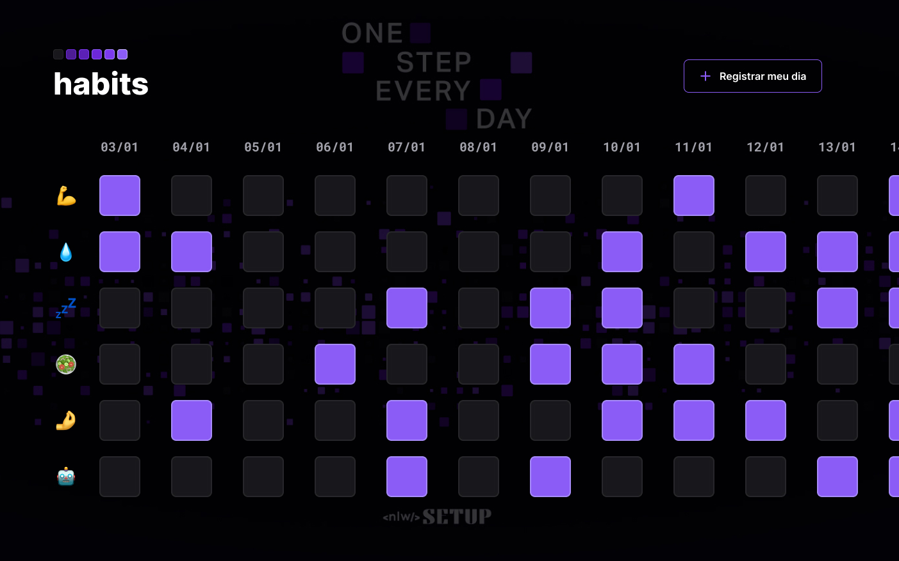

# 📝 Projeto Hábitos - NLW Setup - (Rocketseat jan-2023)

Habits Project - NLW Setup - (Rocketseat jan-2023)

# 🚀 Technologies

This project was developed with the following technologies:

PT-BR: Esse projeto foi desenvolvido com as seguintes tecnologias:

- [HTML](##HTML)
- [CSS](##CSS)
- [JavaScript](##javascript)
- [Git](https://git.com/)
- [Github](https://github.com/)

# 💻 Project

Project made in Rocketseat's course "NLW Setup" - Habits, with the objective from the "app" record healthy daily habits.

PT-BR: Esse projeto foi desenvolvido com base nas aulas passadas pela Rocketseat no curso "NLW Setup" - Habits, com o objetivo
do "app" registrar hábitos diários saudáveis.

- **[Online project](../index.html)**

#

                Feito com 🤍 by BM

#

###### Rocektseat (jan-2023)
